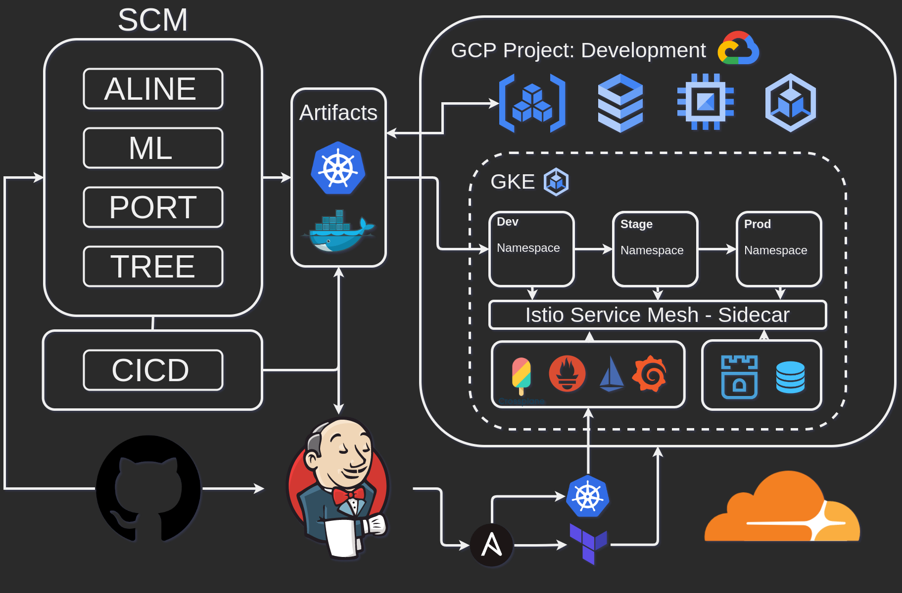

 
# HEIROPHANY - Monxun's Kubernetes/DevOps Toolbox

DESCRIPTION: 
Contains Portable Workflows, Best Practices, And Resources For ALL DEPLOYMENTS!

/DEPLOYMENT - Portable Deployment Pipelines
/DIAGRAMS   - Component, Workflow Diagrams
/TEMPLATES  - Component Code Templates, Modules, Configs, YAML, Etc...

# PROJECT WORKFLOW OUTLINE

PLANNING
1. Diagram Containers, Networking, Clusters, Deployment

CONTAINERS & IMAGES
2. Create Dockerfiles, Compose, .env
3. Test Stacks Locally

KUBERNETES
4. Create Kubernetes Manifests, Secrets, Configmaps
5. Test Kubernetes Manifests Locally
6. Create Helm Charts, Crossplane Custom Objects
7. Add Sidecar Apps, Service Mesh, Vault, Logging, Monitoring, As Chart Dependencies

CICD
8. Create Terraform Files
9. Create Ansible Playbooks
10. Create Jenkins Files, Gitflows
11. Setup Repositories
12. Test Pipeline

# GCP ALine Jenkins CI/CD Pipeline 

Step 1: Setup GCLOUD CLI
https://cloud.google.com/sdk/docs/install-sdk

* AUTHENTICATE USING SMOOTHSTACK GMAIL

Step 2: Configure GClOUD CLI & Authorize Image / Helm Repositories

    `gcloud init`

    `gcloud auth configure-docker \
        us-east1-docker.pkg.dev`

Step 3: Create Project

    `export PROJECT_ID=<your-project-id>`

    `gcloud projects create $PROJECT_ID --name=$PROJECT_ID --set-as-default`

Step 4: Create Subnet and Cluster in Project VPC

    `gcloud container clusters create CLUSTER_NAME \
            --region=us-east1 \
            --enable-ip-alias \
            --create-subnetwork name=aline-cluster-subnet,range=10.5.0.0/20`

    `kubectl cluster-info`

Step 5: Push Images to Artifact Repository

(IMAGE NAME FORMAT: us-east--docker.pkg.dev/aline-jenkins-gcp/nightwalkers-images/your-image-name)

    `gcloud auth login`

    `docker tag <my-docker-image> us-east--docker.pkg.dev/aline-jenkins-gcp/nightwalkers-images/<your-image-name>`

# CICD CONFIGURATION

- JENKINS:
https://www.youtube.com/watch?app=desktop&v=IDoRWieTcMc&feature=youtu.be
https://www.linkedin.com/pulse/create-cicd-pipeline-jenkins-google-kubernetes-engine-pralay-debroy/?trk=articles_directory

- HELM:
https://cloud.google.com/artifact-registry/docs/helm/manage-charts
https://helm.sh/docs/topics/chart_repository/

- SONARQUBE:
https://kubernetes.io/docs/concepts/services-networking/dns-pod-service/
https://docs.sonarqube.org/latest/analysis/scan/sonarscanner-for-jenkins/
https://docs.sonarqube.org/latest/setup/sonarqube-on-kubernetes/

- STORAGE:
https://rook.io/
https://openebs.io/
https://cloudian.com/guides/understanding-kubernetes-multi-tenancy/kubernetes-storage-101-concepts-and-best-practices/
https://kubevious.io/blog/post/comparing-top-storage-solutions-for-kubernetes

- CICD:
https://www.youtube.com/watch?v=rgxbeIvQj0Q
https://www.youtube.com/watch?v=d3isYUrPN7s

- CROSSPLANE:
https://www.youtube.com/watch?v=n8KjVmuHm7A

